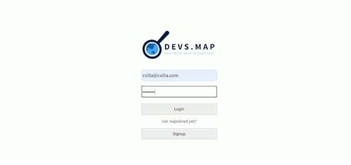

###  General Assembly, Software Engineering Immersive 
 
# Dev.Map 🌎

Dev.Map is a travel sharing platform for developers.
Users can create an account to share their experience in a particular city, add new city information it is not in the database and also chat, network with local like minded people.


This was my first MERN stack (MongoDB, Express.js, React.js & Node.js) application.
My focus was to build the app’s reviewing function, whereby a user can post, edit and delete comments when authenticated.


Deployed on Heroku: https://dev-map-cs.herokuapp.com/
 

Quick peek of the working app ⬇️




## Overview
We worked as a team of three - I have contributed with Laura C Harvey and Sherryll Elliott - on this project. Each day we had a team stand-up to discuss our next steps. We were working on features individually but also collaborated throughout the day to solve problems or debug each others' code.
 
We built a `MongoDB` database of cities, and served this data using `Express`. Used `JWT Authentication` to create accounts, login and update profiles. The front end is built with React where users can search for cities and connect with other users in the chosen city. They can delete, update, create comments on the city page and also add a new city to the database.
 
## Brief
- Build a full-stack application by making your own back- and  front end
- Use an Express API to serve your data from a Mongo database and/or build your own
- Build a complete product- multiple relationships and CRUD functionality for the models
- Build a professional frontend design with React
- Deploy online so it's publicly accessible
 
## Technologies Used

- JavaScript(ES6)
- <span style="color: orange;">M</span>ongoDB and Mongoose
-  <span style="color: orange;">E</span>xpress
-  <span style="color: orange;">R</span>eact
-  <span style="color: orange;">N</span>ode.js
- Bcrypt & JWT
- Insomnia 
- SCSS
- Git and GitHub
- Heroku
- Mongo Atlas 
   
## Approach Taken
The original idea was a dating app which has evolved throughout time and turned into a professional’s sharing platform for travel and coding enthusiasts.
 
First we had a whiteboard session to figure out the basic structure and functions and also set the MVP and the stretch goals.
We built the fundamentals of the user and city schema together along with the starter controller function. We also populated the database with some example data to kickstart the project. 

## Method
 
**Authorization**

For authorization I have used `JWT`.
JSON web token is a standardized, optionally validated and/or encrypted container format that is used to securely transfer information between two parties.
When a user is successfully logged in the backend returns a signed `JWT` that can be used for subsequent secured requests.
```javaScript
function loginUser(req, res) {
  User
    .findOne({ email: req.body.email })
    .then(user => {
      if (!user.validatePassword(req.body.password)) {
        return res.status(401).send({ message: 'Unauthorized' })
      }
      const token = jwt.sign(
        { sub: user._id },
        secret,
        { expiresIn: '48h' }
      )
      res.status(202).send({ token, message: 'Login was successful!' })
    })

}
```
To make the `JWT` verification reusable I have created `secureRoute` middleware. That extracts the token from the `Authorization Header` and uses `JWT` to verify it's validity. 

**Search** 

I also contributed the search function to the app.
In order to store the relevant property values to the Search component, I used the `useState` and `useEffect` React hooks and `axios` to fetch the data from the backend.
 

**Seed**

I was also responsible for creating the script for seeding our database.
I used two APIs
- [The countries](https://restcountries.eu/) `REST API` to get some information about the cities
- [The unsplash API](https://unsplash.com/developers) for the images.

Unfortunately unsplash had a demo limit for requests - 50 requests per hour.
I decided to get all capital cities of the world so that rate-limit was a real problem to get through. I was using a `setInterval` function to get all the images within the boundaries of the API.

```javaScript
 .then((cityInfo) => {
    const promises = []

    for (let i = 0; i < cityInfo.length; i++) {
      const url = `https://api.unsplash.com/search/photos?page=1&query=${encodeURIComponent(cityInfo[i].name)}&client_id=${CLIENT_ID}`
      const timeoutInterval = 1000 * 60 * 1.5 * (i + 1)
      promises.push(new Promise((resolve) => {
        setTimeout(() => {
          axios.get(url)
            .then(({ data }) => {
              cityInfo[i].image = data.results[0] ? data.results[0].urls.full : ''
              console.log(`name: ${cityInfo[i].name}
                           image: ${cityInfo[i].image}`)
              resolve(cityInfo[i])
            })
        }, timeoutInterval)
      }))
    }
    return Promise.all(promises)
  })
```

 I exported the data, cleaned it, converted it to the right format.
 I removed the function above and pasted my new list into the seeding file. **This process saved our team a huge amount of time since the original seeding  would have lasted for 6 hours.**


## Challenges
Since this project was the first we worked on together via GitHub it was challenging sometimes to sync our work and merge the files. By the end of the week we improved a lot and got comfortable working remotely and using Git.
 
## Future enhancements

The "chat users in the city" button takes the user to another separate chat app, that initially we wanted to include in the project. Unfortunately we couldn't manage to merge it on time, so we connected it via a link not to lose this functionality. 

Given more time, we would have also liked to provide more information about the cities, and visualize coffee shops and nice meeting spots on a map.
 

## Lessons learned
As mentioned above, working with a remote team on this app provided an opportunity for me to get more familiar with `Git`, `GitHub` and with the other collaborative tools we used. This included everything from discussing features, working through merge conflicts to organizing our tasks and timelines. 

# Summary
Overall, it was exciting to see how quickly the app took shape.
As the first full stack project I have worked on to completion, it was a very enlightening experience to see how different technologies in the `MERN` stack relate to form a complete whole.
 


